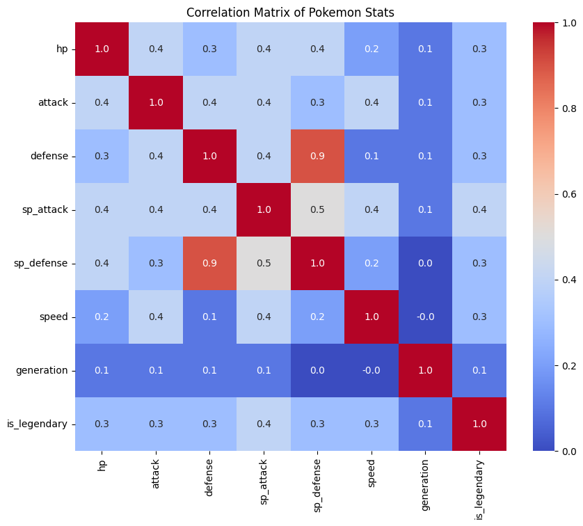
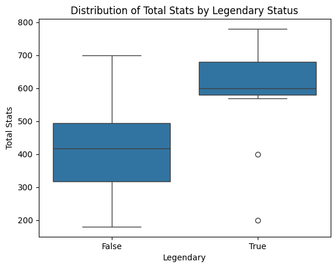

# Statistical Analysis of Pokémon Attributes: Insights into Game Balance and Design
## Skills:
**Python: Pandas, Seaborn, Matplotlib, Scikit-learn, Google Colab**

## Executive Summary:
Using Python, I cleaned and examined Pokémon data to uncover key trends and insights that could inform decision-making for a hypothetical game design team. I analyzed statistical relationships among various Pokémon attributes (Attack, Defense, HP, Speed, and Type) to identify the strongest predictors of total battle performance. This analysis provides quantitative insights into how different attributes interact, which combinations lead to higher overall strength, and how these findings can guide game balance and design decisions.

## Business Problem:
**Question: Which Pokémon characteristics are most influential in determining overall performance?**

Understanding what drives Pokémon performance is crucial for game developers. Identifying these key drivers can help design balanced gameplay by adjusting under or over performing Pokémon, enhance player engagement through balance modifications, and inform future Pokémon designs. 

## Methodology:
### 1. Data Cleaning & Preparation:
* Cleaned column names for consistent formatting 
* Handled missing values for attributes such as type, weight, height, and gender percentage
* Converted numeric attributes to proper data types
* Created Efficiency, Offense, and Defense metrics and Legendary Status boolean column

### 2. Exploratory Data Analysis (EDA)
* Exploring summary statistics of numeric attributes
* Analyzed correlations to reveal association
* Visualized performance distributions for legendary vs non-legendary Pokémon

  

### 3. Regression Analysis
* Built a multiple linear regression model to predict total strength from individual stats and custom metrics such as Efficiency
* Quantified contribution of each statistic to total strength
* Evaluated model performance using R² score and feature coefficients

### 4. Comparative Analysis
* Compared mean stat values based on legendary vs non-legendary status
* Visualized differences in total stats using boxplots
* Ranked top-performing Pokémon by total base stats

  

## Key Findings: 
* All individual stats have a moderate positive relationship with total performance and legendary status.
* Defense and Special Defense are strongly related; Pokémon strong in one are usually strong in the other.
* The regression model shows total stats are perfectly explained by the sum of individual attributes (R² = 1.0). 
* Legendary Pokémon have much higher stats overall than non-legendary ones.

## Insights:
* Each individual stat contributes equally to total performance, so balancing Pokémon strength depends on how individual attributes are distributed.
* Because Defense and Special Defense are closely related, game designers could make battles more interesting by creating Pokémon that are strong in only one type of defense instead of both.
* Legendary Pokémon dominate across metrics, highlighting intentional design imbalance.
* The results confirm that Pokémon stats follow a consistent and balanced structure.

## Business Recommendations: 
* Create Pokémon that specialize in one type of defense (physical or special) to make battles more strategic.
* Redistribute stat points to give Pokémon more unique strengths and weaknesses.
* Balance legendary power levels by introducing trade-offs, such as lower Speed or higher vulnerability.

  

